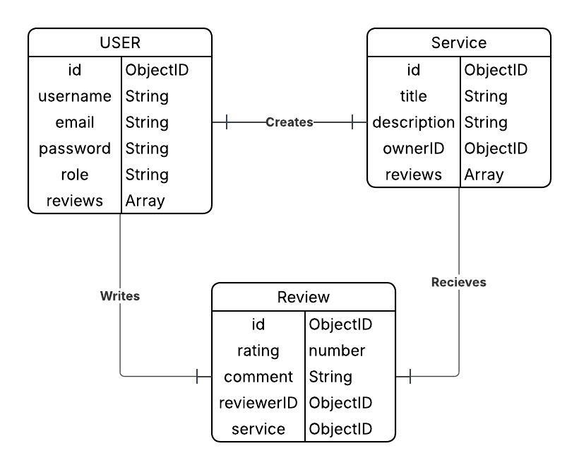

# Skill-Sharing Community Platform

Welcome to the official repository for the Skill-Sharing Community Platform project. This document provides all the necessary information to get the project set up, running, and to contribute effectively.

---

## Getting Started

Follow these steps to get a local copy of the project running on your machine.

### 1. Clone the Code
Navigate to your desired directory in your terminal and clone the repository from GitHub.

```bash
git clone https://github.com/Ashjani/Skill_Sharing_app.git
cd Skill_Sharing_app
````

### 2. Install Dependencies

Once inside the project directory, run the following command to install all the required Node.js packages listed in `package.json`.

```bash
npm install
```

### 3. Configure Environment

This project uses a `.env` file to manage secret keys and configuration variables.

1. Create a new file named `.env` in the root of the project.
2. Copy the contents of the `.env.example` file (or the block below) into your new `.env` file.
3. Fill in the required values.

```env
# .env.example
# -----------------
# The connection string for your local or cloud MongoDB instance
MONGO_URI=mongodb://localhost:27017/skillsharing

# The secret key for signing JSON Web Tokens (JWT)
# Use a long, random, and secure string
JWT_SECRET=your_super_secret_key_here

# The port the application server will run on
PORT=3000
```

---

## Running the Application Locally

To run the application, you'll need two terminals running simultaneously: one for the **MongoDB database** and one for the **Node.js server**.

### 1. Start Your MongoDB Server

Open a new terminal and run the following command to start the MongoDB database. You must leave this terminal running.

```bash
mongod
```

### 2. Start the Node.js Server

Open a second terminal, navigate to the project's root directory, and run the following command to start the application server with **nodemon**, which will automatically restart on file changes.

```bash
npm run dev
```

### 3. Access the Application

Once both servers are running, open your web browser and go to:

```
http://localhost:3000
```

---

## Running Tests

This project includes a full suite of automated tests for the controllers and models. To run all tests, execute the following command from the project root:

```bash
npm test
```

---

## Project Structure

This project follows the **Model-View-Controller (MVC)** architectural pattern to keep the code organized.

* 📁 **models**: Contains all Mongoose schemas, which define the structure of our database documents.
* 📁 **views**: Contains all EJS (`.ejs`) template files, which are rendered to the user's browser.
* 📁 **controllers**: Contains the business logic of the application, handling requests and sending responses.
* 📁 **routes**: Defines the URL endpoints and maps them to the appropriate controller functions.
* 📁 **public**: Contains all static assets, such as CSS, client-side JavaScript, and images.
* 📁 **config**: For configuration files, like the database connection setup.
* 📁 ****tests****: Contains all test files for the application (e.g., for controllers and models).
* 📁 **middleware**: Contains custom middleware functions, such as for authentication and authorization.
* 📁 **assets**: Contains documentation images, like the ERD.

---

## Features & Architecture

### Authentication Pages (Login & Register)

The authentication system introduces two core pages, Login and Register, implemented using EJS for server-side rendering and styled with Materialize CSS.

* **Login Page:** Provides users with access to the platform by entering valid credentials. It features a responsive card layout (`views/auth/login.ejs`) and client-side validation (`public/js/validation.js`).
* **Register Page:** Allows new users to create an account. It uses a consistent responsive design (`views/auth/register.ejs`) and includes client-side validation for email format and password strength.

### Data Flow Summary: Creating a New Review

This summary outlines the step-by-step process of how data moves through the application when a logged-in user creates a new review.

1. **API Request:** A logged-in user submits a review on the frontend, which makes a `POST` request to the `/api/reviews` route. The request includes a JSON Web Token (JWT) in the `Authorization` header and a body with the `serviceId`, `rating`, and `comment`.
2. **Authentication Middleware:** The `protect` middleware intercepts the request. It verifies the JWT to confirm the user is logged in and attaches the user's data to the request object (`req.user`).
3. **Controller Logic:** The request is passed to the `createReview` function in the `reviewController`.
4. **Document Creation:** The controller creates a new `Review` document, populating it with data from the request body and assigning the `user` field based on the ID from `req.user`.
5. **Database Insertion:** The new `Review` document is saved to the `reviews` collection in MongoDB.
6. **Update Relationships:** Upon successful creation, the new review's `_id` is pushed into the `reviews` array within the corresponding `User` and `Service` documents to maintain the one-to-many relationships.
7. **API Response:** The server sends back a `201 Created` status code along with the created review object as a JSON response.

---

## Database Schema

Our application's data is organized into several interconnected Mongoose models.

### ERD (Entity-Relationship Diagram)




### User Collection

* `username`: (String, Required, Unique)
* `email`: (String, Required, Unique)
* `password`: (String, Required, Hashed)
* `credits`: (Number, Default: 1)
* `role`: (String, Enum: ['Member', 'Admin'], Default: 'Member')

### Service Collection

* `title`: (String, Required)
* `description`: (String, Required)
* `category`: (String, Required)
* `user`: (ObjectID, Ref: 'User')
* `status`: (String, Enum: ['available', 'in_progress', 'completed'])
* `ratings`: (Array of embedded Rating documents)

### Review Collection

* `rating`: (Number, Required, Min: 1, Max: 5)
* `comment`: (String)
* `user`: (ObjectID, Ref: 'User', Required)
* `service`: (ObjectID, Ref: 'Service', Required)

### Booking Collection

* `service`: (ObjectID, Ref: 'Service', Required)
* `requester`: (ObjectID, Ref: 'User', Required)
* `provider`: (ObjectID, Ref: 'User', Required)
* `status`: (String, Enum: ['Pending', 'Accepted', 'Completed'], Default: 'Pending')

### MessageThread Collection

* `participants`: (Array of ObjectID, Ref: 'User')
* `messages`: (Array of embedded Message documents)

---

## API Endpoints

| Method   | Path                | Description                               | Access                |
| -------- | ------------------- | ----------------------------------------- | --------------------- |
| `POST`   | `/auth/register`    | Registers a new user.                     | Public                |
| `POST`   | `/auth/login`       | Authenticates a user and returns a token. | Public                |
| `GET`    | `/api/services`     | Retrieves a list of all services.         | Public                |
| `POST`   | `/api/services`     | Creates a new service.                    | Private               |
| `GET`    | `/api/services/:id` | Retrieves a single service by ID.         | Public                |
| `PUT`    | `/api/services/:id` | Updates a service.                        | Private (Owner/Admin) |
| `DELETE` | `/api/services/:id` | Deletes a service.                        | Private (Owner/Admin) |
| `POST`   | `/api/reviews`      | Creates a new review.                     | Private               |
| `PUT`    | `/api/reviews/:id`  | Updates a review.                         | Private (Owner)       |
| `DELETE` | `/api/reviews/:id`  | Deletes a review.                         | Private (Owner)       |

---

## Key Dependencies

* **Express.js**: A fast and minimalist web framework for Node.js used to build our server and handle routing.
* **Mongoose**: An Object Data Modeling (ODM) library for MongoDB and Node.js used for schema validation and data management.
* **Dotenv**: Loads environment variables from a `.env` file, allowing us to keep secrets out of our code.
* **Mocha & Chai**: Our testing framework and assertion library for writing automated tests.
* **bcryptjs**: A library for hashing passwords.
* **jsonwebtoken**: Used for creating and verifying JSON Web Tokens (JWTs) for authentication.

---

## Git Workflow & Contribution Guide

### Our 5-Step Development Workflow

**Step 1: Get the Latest Code & Create a Branch**

```bash
git checkout develop
git pull
git checkout -b <branch-type>/<branch-name>
```

**Step 2: Code and Commit Your Work**

Complete the work on your new branch, making small, regular commits.

> Important: Before pushing, ensure all tests pass by running `npm test`.

```bash
git add .
git commit -m "feat: implement user registration endpoint"
```

**Step 3: Push and Create a Pull Request (PR)**

```bash
git push origin <branch-type>/<branch-name>
```

Then, go to the GitHub repository to create a Pull Request (PR) from your new branch into the `develop` branch.

**Step 4: Link Your PR and Get it Reviewed**
Copy the link to your new Pull Request and paste it into the comments of the corresponding Trello card. Request a review from at least one other team member.

**Step 5: Merge and Close**
Once your PR has been approved, merge it into the `develop` branch. After merging, move the Trello card to the "Done" column.

---

### Commit Message Convention

We follow a standard format for commit messages:

* `feat`: A new feature
* `fix`: A bug fix
* `docs`: Changes to documentation
* `test`: Adding or refactoring tests
* `refactor`: Code changes that neither fix a bug nor add a feature

---

## Troubleshooting

### `mongod` Command Not Recognized

* **Problem:** You run `mongod` and get a "command not recognized" error.
* **Reason:** MongoDB is installed, but its `bin` directory is not in your system’s PATH variable.
* **Solution:** Locate your MongoDB `bin` directory (e.g., `C:\Program Files\MongoDB\Server\7.0\bin`) and add it to your system’s environment variables.

### `git pull` Fails with "no tracking information"

* **Problem:** You run `git pull` on a new branch and see an error like `There is no tracking information for the current branch.`
* **Reason:** This happens when your local branch doesn't know which branch to track on GitHub. It's a one-time setup for a new branch.
* **Solution:** The first time you push a new branch, use the `-u` flag to set the upstream tracking link.

```bash
git push -u origin <branch-name>
```

After running this once, you can use `git pull` and `git push` as normal.

### Adding Reviewers to a Pull Request

On the Pull Request creation page, find the **"Reviewers"** section on the right-hand sidebar and click the gear icon ⚙️ to select teammates to review your code.


